## Ohjelmistokehityksen teknologioita -kurssin seminaarityö
<p style="float: right;">Henna Paananen</p>

# **Python peliohjelmointi: Pygame**

Pygame on peliohjelmointia varten Python-ohjelmointikieleen tehty moduuli (Pygame, Wikipedia). Se sisältää grafiikka- ja äänikirjastoja. Suomalainen kehittäjä Unreal Voodoo on voittanut Pygame-kirjastolla tekemällään Frets on Fire pelillä Assemblyn pelikehityskilpailun vuonna 2006 (Frets on Fire, Wikipedia).

[Lista Pygame - sovelluksista](https://www.pygame.org/tags/pygame)

Valitsin seminaariaiheekseni Pythonin ja peliohjelmoinnin, koska kaipasin lisää harjoittelua Pythonin kanssa ohjelmoinnista ja minulla ei ollut paljon aikaisempaa kokemusta peliohjelmoinnista. Projekti peliohjelmoinnin parissa sopii myös hyvin opintoihini, jotka ovat painottuneet Ohjelmistotuotannon - ja Digitaalisten palveluiden polkuihin.

Peliala on jatkuvasti kasvava ala ja esimerkiksi vuonna 2020 alalla taottiin enemmän rahaa kuin elokuva- ja musiikkiteollisuudessa yhteensä (Game Development Industry 2021, Alex Staff Agency).

### Tutkimuskysymykset - ja tavoitteet:

- Onko Pygamea mahdollista oppia lyhyessä ajassa?

- Vaatiiko peliohjelmointi paljon matemaattisia taitoja?

- Suunnitella ja luoda peli Pygamen avulla

- Kehittää Python - ohjelmointitaitoja

- Saada perusymmärrys peliohjelmoinnista


# Esikatselu: Safari Bunny

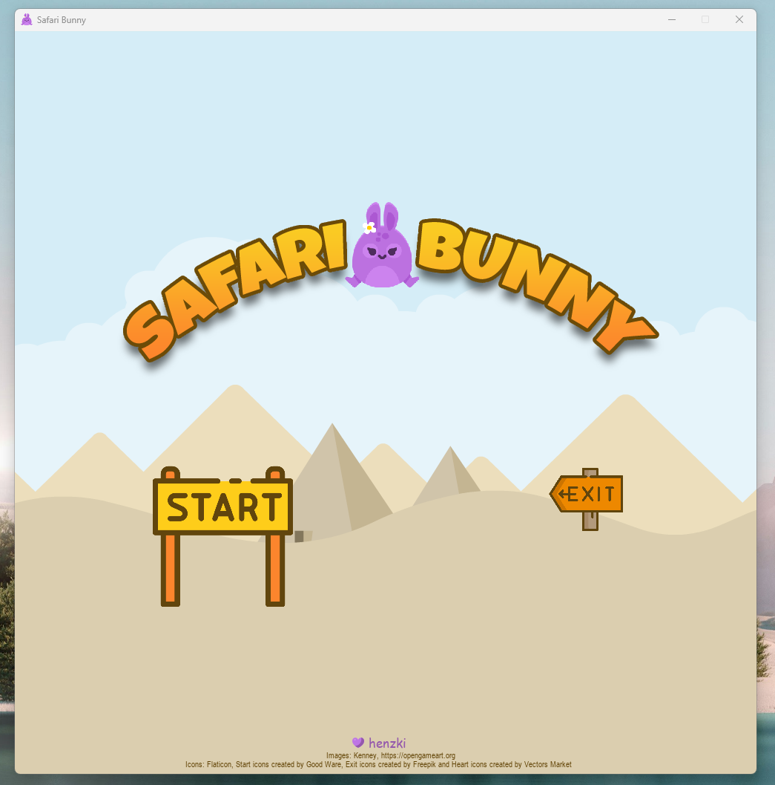

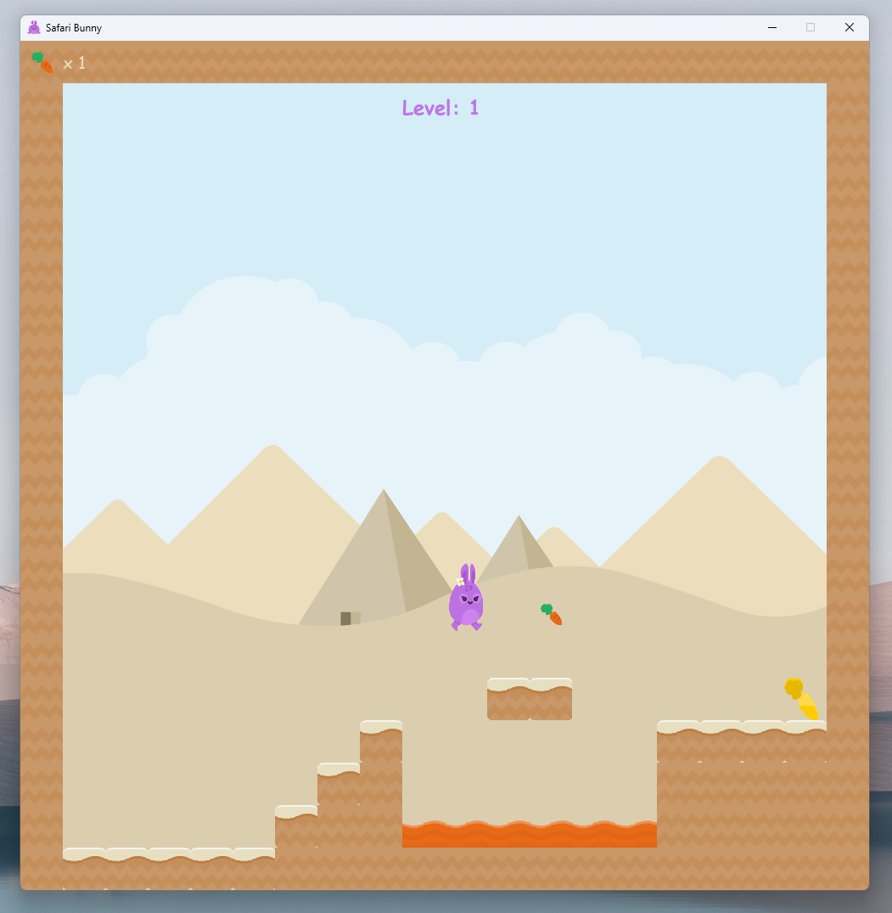

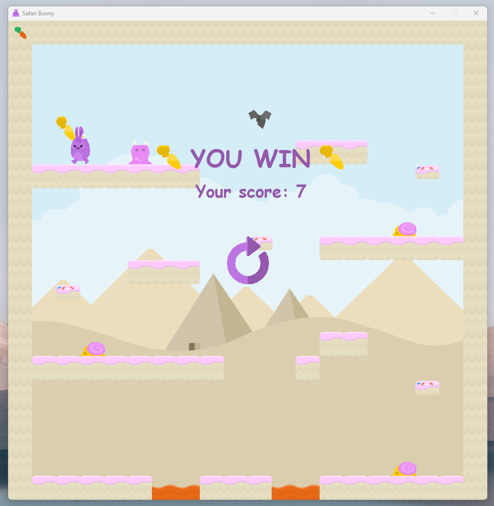


## **Asennukset**

- Pygame asennusohje Windowsille: [GeeksForGeeks How to Install Pygame in Windows](https://www.geeksforgeeks.org/how-to-install-pygame-in-windows/) 

```
pip install pygame
```

Virhe:
WARNING: Ignoring invalid distribution -ip (c:\python310\lib.\site-packages

Korjattu poistamalla ~-alkuiset tiedostot. [Stack Overflow ohje](https://stackoverflow.com/questions/56973015/pip-how-to-remove-incorrectly-installed-package-with-a-leading-dash-pkgname/64939049#64939049) 

## Pygame harjoittelua

- Opin henkilökohtaisesti parhaiten tekemällä, joten seurasin **Free Code Campin** tutoriaalia, jossa opeteltiin Pythonia rakentamalla viisi peliä: [Free Code Camp: Learn Python by Building Five Games - Full Course](https://www.youtube.com/watch?v=XGf2GcyHPhc)

- Rakensin näistä peleistä kaksi ensimmäistä, eli pingis- ja matopelin:

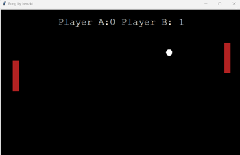 
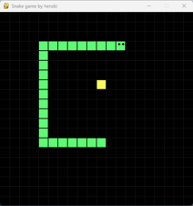


## **Pygame käsitteitä**

- ### Animaatio
Luodaan objekteille liikkumista muistuttava efekti toistamalla kuvia peräkkäin.

Alla olevassa esimerkissä näytetään kahta kuvaa vuoron perään kun hahmo liikkuu vasemmalta oikealle ja samat kuvat käännetään ympäri *flip* - funktiolla, kun hahmo liikkuu oikealta vasemmalle.

```
for num in range(1, 3):
    img_right = pygame.image.load(f'images/bunny_walk{num}.png')
    img_right = pygame.transform.scale(img_right, (40, 80))
    img_left = pygame.transform.flip(img_right, True, False)
    self.images_right.append(img_right)
    self.images_left.append(img_left)

if self.counter > walk_cooldown:
    self.counter = 0    
    self.index += 1
    if self.index >= len(self.images_right):
        self.index = 0
    if self.direction == 1:
        self.image = self.images_right[self.index]
    if self.direction == -1:
    self.image = self.images_left[self.index]
```

- ### Blit (*Block Transfer*)
Kopioi objektiin kuuluvat pikselit kohdeobjektiin. Tekee halutun asian näkyväksi näytöllä. Sitä ei suositella käytettävän liikaa, koska se on yksi hitaimpia operaatioita ([Pygame - Revision: Pygame fundamentals](https://www.pygame.org/docs/tut/tom_games2.html)).

Tässä tehdään painikkeet näkyviksi näytöllä:

```
screen.blit(self.image, self.rect)
```

- ### Draw
Voidaan piirtää esimerkiksi muotoja tai kirjoittaa tekstiä. Tekee halutun asian näkyväksi näytöllä.

Piirretään *Sprite - ryhmiä* näytölle:

```
spikeman_group.draw(screen)
platform_group.draw(screen)
lava_group.draw(screen)
carrot_group.draw(screen)
```

- ### Game Loop
Usein *while: true*. Pääsilmukka, jossa peli pyörii kunnes se pysäytetään

```
run = True
while run:
    //tee
    //tämä

    for event in pygame.event.get():
        # Quitting the game
        if event.type == pygame.QUIT:
            run = False
```

- ### Koordinaatit

Peli rakentuu x- ja y-akseleille. Pelin näyttö alkaa kohdasta (0,0) ja jatkuu niihin rajoihin, mitkä sille on määritetty.

Koordinaattien ymmärtäminen tekee kehittämisestä helpompaa, sillä kaikki elementit tarvitsevat sijainnin, jossa ne näytetään näytöllä. Se helpottaa myös liikkeen ymmärtämistä, esimerkiksi x:n arvoa kasvattamalla voidaan liikkua oikealle.

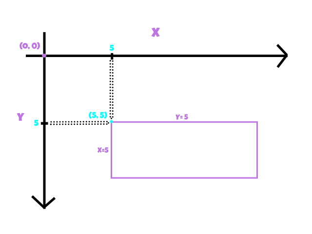


- ### Rect
Pelin eri objektit ovat usein suorakulmioista, jotka auttavat esimerkiksi objektien törmäämisen (engl. collide) määrittelyssä.

Esimerkiksi:

``` 
def __init__(self, x, y, image):
        self.image = image
        self.rect = self.image.get_rect()
        self.rect.x = x
        self.rect.y = y
        self.clicked = False

    def draw(self):
        action = False
        pos = pygame.mouse.get_pos()

        # Mouse position and clicked
        if self.rect.collidepoint(pos):
            if pygame.mouse.get_pressed()[0] == 1 and self.clicked == False:
                action = True
                self.clicked = True
```

Tässä määritellään koodissani olevalle Button() - luokalle suorakulmio, jota on kätevää hyödyntää tilanteessa, jossa halutaan määrittää painikkeelle tietty alue.

- ### Screen
Näyttö, joka luodaan usein pygame.display.set_mode() - funktion avulla.

Esimerkiksi näin:
```
screen_width = 1000
screen_height = 1000
screen = pygame.display.set_mode((screen_width, screen_height))
pygame.display.set_caption('Safari Bunny')
pygame.display.set_icon(bunny_start_img)
```

Leveys ja korkeus annetaan pixeleinä ja syötetään pygame.display.set_mode() - funktiolle.

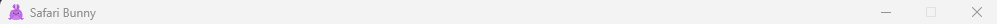

pygame.display.set_caption() - funktio tekee näytölle otsikon.

pygame.display_set_icon() - funktio asettaa ikonin kuvasta, joka on tuotu aiemmin sovellukseen.


- ### Sprite
Sprite-moduuli mahdollistaa helpon tavan tehdä erilaisia objekteja näytölle.

Esimerkiksi:

```
class Carrot(pygame.sprite.Sprite):
    def __init__(self, x, y):
        pygame.sprite.Sprite.__init__(self)
        // jne
```
Tässä käytin Sprite-moduulia luomaan toiminnallisen Carrot - luokan pelissäni. 

Tasot sisältävät useampia porkkanoita, joita pelaajan tulee kerätä. Porkkanat ovat ryhmitetty, että niitä on esimerkiksi helpompi kutsua samanaikaisesti. 

```
carrot_group = pygame.sprite.Group()
```


- ### Surface
Näyttää graafista tietoa, esimerkiksi näytön.


# **Safari Bunny**

Safari Bunny on *tasohyppelypeli* (engl. Platform game), joka koostuu erilaisista tasoista erilaisine haasteineen. Pelissä ohjataan violetin väristä pupua, kerätään pisteitä ja pyritään läpäisemään tasoja.

Sovellettu [Coding With Russ - PyGame Platformer Tutorial](https://www.youtube.com/playlist?list=PLjcN1EyupaQnHM1I9SmiXfbT6aG4ezUvu) - soittolistan ohjeista. Pelin runko on samankaltainen siinä tuotetun pelin kanssa.

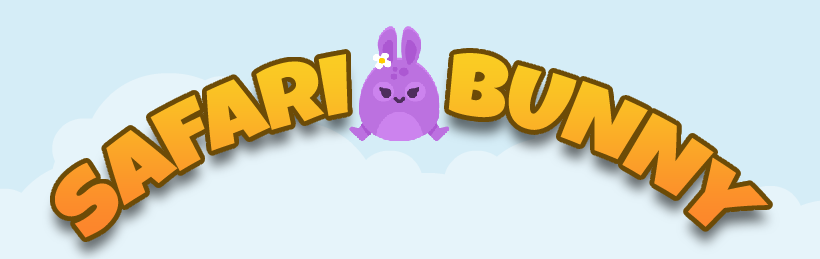

### Tasohyppelypeli

Huomattavimpiin tasohyppelypeleihin kuuluu mm. Super Mario Bros. ja Sonic The Hedgehog (Tasohyppely, Wikipedia).

Yleiset elementit

-   Yksinkertaiset kontrollit
-   Monentyyppiset miljööt
-   Kerättävät esineet
-   Vastustajalle puolustautuminen eri menetelmin

## Media

- **Otsikko teksti**: Luotu [Photopea](https://www.photopea.com/) - sivustolla.
- **Kuvat**: Peli koostuu [Kenney](https://kenney.nl/) kuvista, jotka on kaikki [OpenGameArt.org](https://opengameart.org/) - sivustolta.
- **Ikonit**: Suurin osa ikoneista on [Flaticon](https://www.flaticon.com/) - sivustolta, ja kaksi ikonia (save ja load) on luotu Photopea - sivustolla.
- **Äänet**: Kaikki pelin äänet ovat [Freesound](https://freesound.org/) - sivustolta.


### Pelihahmo:

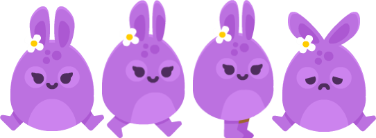

Määritetään Player - luokassa:

```
class Player():
    def __init__(self, x, y):
        self.reset(x, y)
```

### Lohkoja (engl. blocks): 


Määritetään sijainti World - luokassa:

```
if tile == 2:
    img = pygame.transform.scale(sand_img, (tile_size, tile_size))
    img_rect = img.get_rect()
    img_rect.x = col_count * tile_size
    img_rect.y = row_count * tile_size
    tile = (img, img_rect)
    self.tile_list.append(tile)
```


### Liikkuvat tasot:


Määritetään models/platforms.py - tiedostossa:

```
class Platform(pygame.sprite.Sprite):
    def __init__(self, x, y, move_x, move_y):
        pygame.sprite.Sprite.__init__(self)
        img = pygame.image.load('images/platform.png')
        self.image = pygame.transform.scale(img, (tile_size, tile_size))
        self.rect = self.image.get_rect()
        self.rect.x = x
        self.rect.y = y
        self.move_direction = 1
        self.move_counter = 0
        self.move_x = move_x
        self.move_y = move_y
```

### Vastustajat:

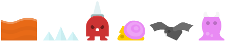

Määritetään models/enemies.py - tiedostossa:

```
class Lava(pygame.sprite.Sprite):
    def __init__(self, x, y):
        pygame.sprite.Sprite.__init__(self)
        img = pygame.image.load('images/lava.png')
        self.image = pygame.transform.scale(img, (tile_size, tile_size))
        self.rect = self.image.get_rect()
        self.rect.x = x
        self.rect.y = y
```


### Porkkanat:


Määritetään models/carrots.py - tiedostossa:

```
class Carrot(pygame.sprite.Sprite):
    def __init__(self, x, y):
        pygame.sprite.Sprite.__init__(self)
        img = pygame.image.load('images/carrot.png')
        self.image = pygame.transform.scale(img, (tile_size // 2, tile_size // 2))
        self.rect = self.image.get_rect()
        self.rect.center = (x, y)
```

### Painikkeet:

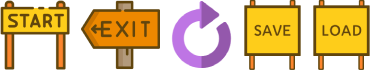

Määritetään Button - luokassa:
```
class Button():
    def __init__(self, x, y, image):
        self.image = image
        self.rect = self.image.get_rect()
        self.rect.x = x
        self.rect.y = y
        self.clicked = False
```

## Pelimaailma

Luodaan World - luokka ja sille lista pysyvistä elementeistä:

```
def __init__(self, data):
    self.tile_list = []
```


Käydään läpi *data*, joka haetaan /levels - kansiosta.

```
row_count = 0
for row in data:
    col_count = 0
    for tile in row:
        # Sand center
        if tile == 1:
            img = pygame.transform.scale(sandCenter_img, (tile_size, tile_size))
            img_rect = img.get_rect()
            img_rect.x = col_count * tile_size
            img_rect.y = row_count * tile_size
            tile = (img, img_rect)
            self.tile_list.append(tile)
        # Sand
        if tile == 2:
            //tee
            //tämä
        // jne
```

Data sisältää arvoja 0 - 20 välillä ja se haetaan seuraavasti:

```
if path.exists(f'levels/level{level}'):
    pickle_in = open(f'levels/level{level}', 'rb')
    world_data = pickle.load(pickle_in)
world = World(world_data)
```

Maan piirtäminen:

```
def draw(self):
    for tile in self.tile_list:
        screen.blit(tile[0], tile[1])
```


## Toiminnot

### Pelaajan liikkuminen

Määritetään pygame.key.get_pressed() - funktion avulla, mitä nappia painammalla saadaan pelaaja liikkumaan.

```
key = pygame.key.get_pressed()
# Jump
if key[pygame.K_SPACE] and self.jumped == False and self.in_air == False:
    jump_sound.play()
    self.vel_y = -20
    self.jumped = True
if key[pygame.K_SPACE] == False:
    self.jumped = False
# Go left
if key[pygame.K_LEFT]:
    dx -= 5
    self.counter += 1
    self.direction = -1
# Go right
if key[pygame.K_RIGHT]:
    dx += 5
    self.counter += 1
    self.direction = 1
if key[pygame.K_LEFT] == False and key[pygame.K_RIGHT] == False:
    self.counter = 0
    self.index = 0
```

### Painovoima

Määritetään painovoima asettamalla y-akselilla nopeutta säätävä *speed_y* arvo nousevaksi ja sille rajaehto. Kun pelaaja hyppää tämä arvo laskee, mikä näyttää näytöllä pelaajan hyppäävän.

```
self.speed_y += 1
if self.speed_y > 10:
    self.speed_y = 10
dy += self.speed_y
```

Jotta hyppäämistä ei voida suorittaa ilmassa, asetetaan pelaajalle arvo, joka kertoo onko pelaaja ilmassa. Kun pelaaja hyppää arvoksi asetetaan *True*, muuten arvo on *False*.

```
self.in_air = True
```


### Törmäys (*Collision*)

Määritetään *world.tile_list* - listaan kuuluvien *tile* - jäsenien kohdalla, ettei pelaaja voi kulkea näiden läpi mistään suunnasta.

```
for tile in world.tile_list:
    # X direction
    if tile[1].colliderect(self.rect.x + dx, self.rect.y, self.width, self.height):
        dx = 0
    # Y direction
    if tile[1].colliderect(self.rect.x, self.rect.y + dy, self.width, self.height):
        # Check if below ground, jumping
        if self.speed_y < 0:
            dy = tile[1].bottom - self.rect.top
            self.speed_y = 0
        # Check if above ground, jumping
        elif self.speed_y >= 0:
            dy = tile[1].top - self.rect.bottom
            self.speed_y = 0
            self.in_air = False
```

Törmäykseen voidaan asettaa myös ehdoksi esimerkiksi pelin loppuminen:

```
if pygame.sprite.spritecollide(self, spikeman_group, False):
                game_over = -1
```

### Tason päivitys

Tason päivitystä hoitavat muuttujat:

| arvo | game_over |
| :--: | :-----: |
| -1 | Peli päättyi |
|  0 | Peli käynnissä |
| 1  | Peli läpäisty |

- **level** - kertoo nykyisen tason
- **max levels** - kertoo tasojen maksimimäärän


Tasojen päivittämisen logiikka:

```
# Player lost
    if game_over == -1:
        if restart_button.draw():
            world_data = []
            world = reset_level(level)
            game_over = 0
            score = 0
        
# Player won
    if game_over == 1:
        # Go to next lever
        level += 1
        score = 0
        if level <= max_levels:
            # Reset the level
            world_data = []
            world = reset_level(level)
            game_over = 0
        else:
            draw_text('YOU WIN', font, yellow, (screen_width // 2) - 100, 200)
            # Restart the game
            if restart_button.draw():
                level = 0
                world_data = []
                world = reset_level(level)
                game_over = 0
                score = 0
```

Tason resetoimisessa on tärkeää muistaa asettaa siihen kaikki elementit, jotka ovat tasokohtaisia, sillä muuten ne siirtyvät seuraavalle tasolle.


# Pohdinta

Jälkikäteen mietittynä Pygamen opettelu ei ollut sen haastavempaa kuin minkään muun uuden ohjelmointiin liittyvän asian opettelu, kun eteni siinä asia kerrallaan.

Tutkimuskysymyksiin palaten, Pygamen alkeet ja peruskäsitteet voi oppia lyhyessäkin ajassa, kun taas syvällisempään oppimiseen menisi enemmän aikaa. Toki tämä riippuu paljon henkilön ohjelmointitaustasta.

Ennakkokäsitykseni oli, että peliohjelmointi vaatii erityisen paljon matemaattisia taitoja. Sanotaan, että peliohjelmoijan tulisi tuntea lineaarialgebra, laskeminen, geometria, trigonometria, tilastot jne (4. Game Developer, Educative). Eniten matemattisia asioita Pygame - peliohjelmoinnissa tuli omalla kohdallani mietittyä x - ja y - koordinaattien kanssa. Aluksi saatoin esimerkiksi laittaa jonkun asian liikkumaan täysin päinvastaiseen suuntaan, mutta hetken koordinaattien kanssa väännettyä alkaa muistamaan miten ne toimivat.

Pelin suunnittelu ja luominen oli mielenkiintoista. Sain määräajassa luotua valmiin sovelluksen, mikä oli tavoitteenani. Tämä on isoin tekemäni projekti Python-ohjelmointikielellä ja koen, että taitoni ovat kehittyneet paljon sen aikana.

Projektin tekeminen on avannut peliohjelmoinnin maailmaa täysin uudella tavalla. Jotain minkä koin itselleni mahdottomaksi muuttuikin ihan realistiseksi asiaksi. Pygame on mielestäni hyvä työkalu pelien tekemisen aloittamiseen. Se tarjoaa paljon mahdollisuuksia ja sen avulla on helppo ymmärtää pelien perusideaa. Kaiken lisäksi se on ilmainen. Yksinkertaisen pelin pystyy luomaan esimerkiksi muutamalla suorakulmiolla, joille on asetettu arvoja, kuten liikettä tai törmäämisen yhteydessä liikken estäminen.

Kokemukseni jälkeen voin lämpimästi suositella Pygamen kokeilemista. Omalla kohdallani aika vaan vierähti, kun pääsi tekemään ja kokeilemaan.

### Linkit

- Linkki projektiin: [Henzki GitHub](https://github.com/henzki/pygame-safaribunny)

- Linkki videoon: [Safari Bunny 2022](https://youtu.be/C6TGAK7u_kg)


# Lähdeluettelo

[Alex Staff Agency - Game Development Industry 2021: prospects and trends for developers](https://alexstaff.agency/gamedev-trends-2021)

[Coding With Russ - PyGame Tile Based Platformer Game Beginner Tutorial in Python](https://www.youtube.com/playlist?list=PLjcN1EyupaQnHM1I9SmiXfbT6aG4ezUvu)

[Educative - How much math do you need to know to be a developer?](https://www.educative.io/blog/how-much-math-do-developers-need#game-development)

[Pygame - Make Games](https://www.pygame.org/docs/tut/MakeGames.html)

[Pygame - Newbie Guide](https://www.pygame.org/docs/tut/newbieguide.html)

[Pygame - Revision: Pygame fundamentals](https://www.pygame.org/docs/tut/tom_games2.html)

[Pygame - Sovelluksia](https://www.pygame.org/tags/pygame)

[Pygame - Sprite Intro](https://www.pygame.org/docs/tut/SpriteIntro.html)

[Pygame - Surface](https://www.pygame.org/docs/ref/surface.html)

[Sigon - Pygame Rect Object](https://sigon.gitlab.io/post/2018-10-10-pygame-rect/)

[Wikipedia - Frets on Fire](https://en.wikipedia.org/wiki/Frets_on_Fire)

[Wikipedia - Pygame](https://en.wikipedia.org/wiki/Pygame)

[Wikipedia - Tasohyppely](https://fi.wikipedia.org/wiki/Tasohyppely)
